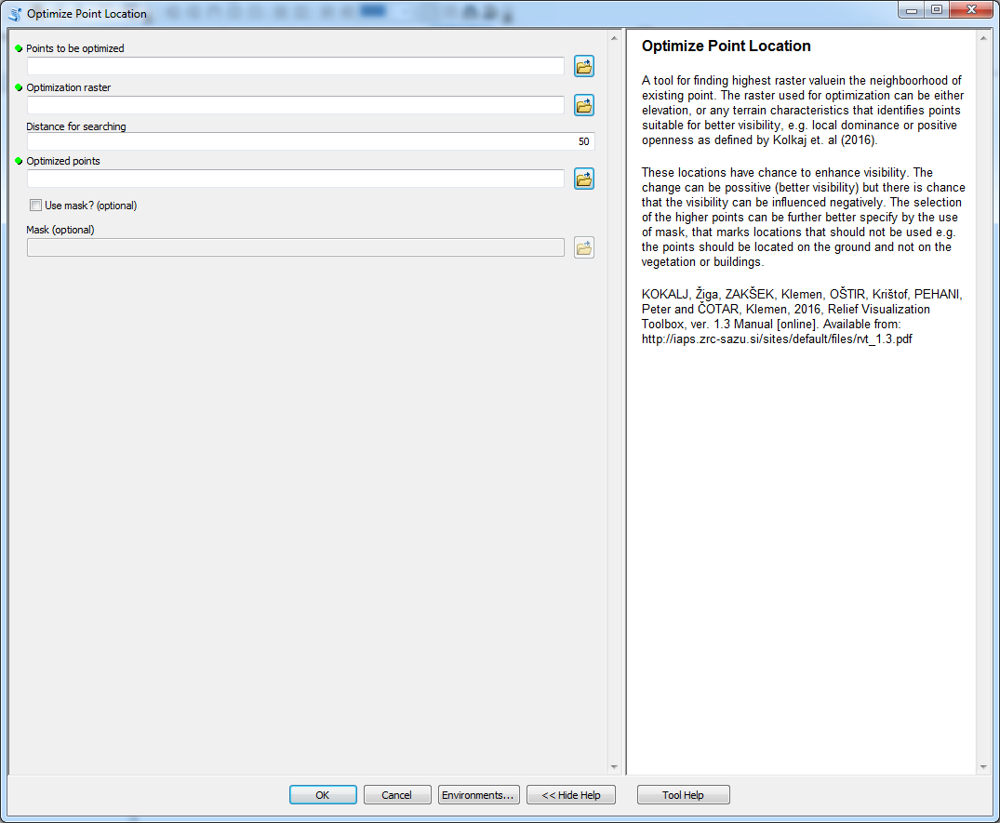

# Optimize Point Location

optimization of point location with respect to values of the raster

## Description

A tool designed for optimization of point location with respect to values of the raster. The tool selects highest value of the raster within the distance for searching and moves the point to that location. The higher value of the raster is likely to point at locations with higher visibility potential. However, in some cases the higher raster values do not necessarily lead to better visibility. This is caused by the fact that the visibility is affected by many parameters and thus it is quite problematic to properly optimize point's locations.

The optimization can be based on elevation or other surface characteristics like positive openness or local dominance that are implemented in [Relief Visualization Toolbox](http://iaps.zrc-sazu.si/en/rvt#v).

## Tool parameters

| Parameter name | Parameter type | Description |
| ------------- |-------------| -----|
| **Optimization raster** | *raster* | layer that is used to optimize point location (e.g. elevation, local dominance, positive openness or some other characteristics). |
| **Points to be optimized** | *features - points* | points which location should be optimized. |
| **Distance for searching** | *numerical value* | maximal distance at which the values from **Optimization raster** are considered. |
| _**Optimized points**_ | _**features - points**_ | _**output layer of optimized points.**_ |
| **Use mask?** | *boolean* | variable that defines if the mask for point's location should be used. |
| **Mask** | *raster* | raster where values higher then zero specifies locations that can be used for point location. Values lower or equal to zero define areas that can not be used for points. |

## Outputs

New point feature class with points moved to optimized locations.
	
## Tool screenshot

	