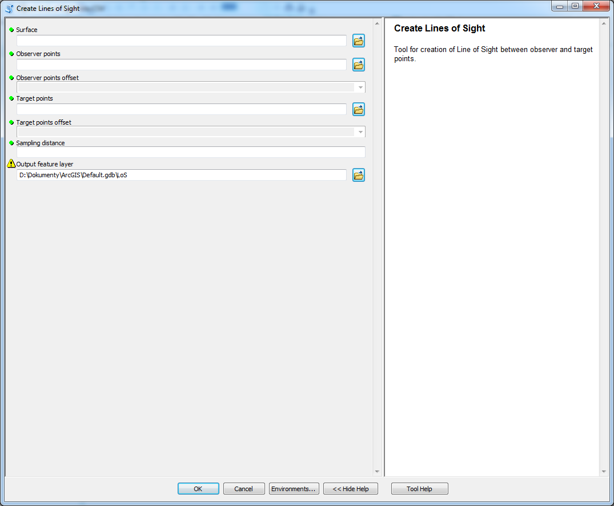

# Create Lines of Sight

create Lines of Sight amongst observer and target points

## Description

A tool used to create Lines of Sight amongst observer and target points. Offsets of both observer and target points are specified as fields to allow individual setting for each point. LoS are created between every observer and target point which means that if there are \( n \) observer points and \( m \) target ponts then there will be \( n \times m \) lines-of-sight.

## Tool parameters

| Parameter name | Parameter type | Description |
| ------------- |-------------| -----|
| **Surface** | *raster* | surface on which the LoS are determined. |
| **Observer points** | *features - points* | locations of observing points. |
| **Observer points offset** | *field - double* | field of the layer **Observer points** that has data type Double. The parameter specifies vertical offset of the observer from the surface. |
| **Target points** | *features - points* | locations of target points. |
| **Target points offset** | *field - double* | field of the layer **Target point** that has data type Double. The parameter specifies vertical offset of the observer from the surface. |
| **Sampling distance** | *numeric value* | value in units specified by Surface coordinate system that determines how often the points are placed on LoS. Default value is the same as cellsize of Surface. |
| _**Output feature layer**_ | _**features - lines**_ | _**output layer.**_ |

## Outputs

Line feature class with lines-of-sight, that has Z-dimension. Specific fields are **OID_OBSERV**, **observ_offset**, **OID_TARGET** and **target_offset** which are necessary for further analyses. The geometry store coordinates (X,Y and Z) purely from the surface without the offsets which are stored in fields.
	
## Tool screenshot

	