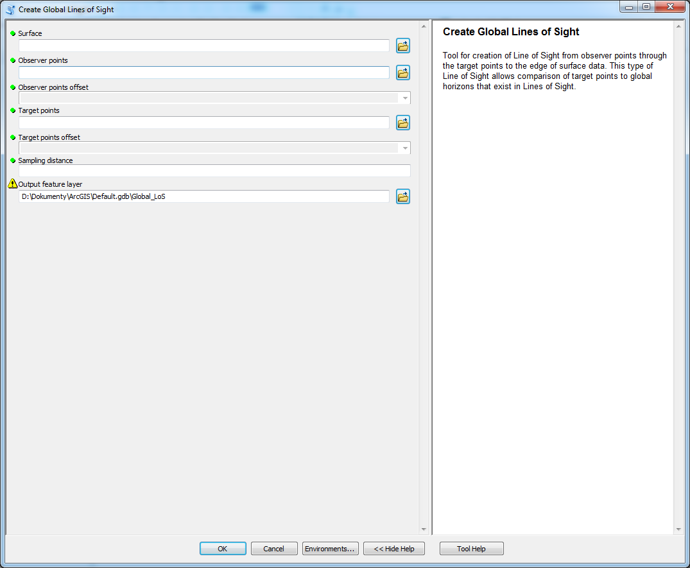

# Create Global Lines of Sight

creates LoS that does not end at target point but goes beyond it and ends at extent of the surface used to define LoS

## Description

This tool is basically the same as [Create Lines of Sight](02_Create_Lines_of_Sight.md) but creates LoS that does not end at target point but goes beyond it and ends at extent of the surface used to define LoS

## Tool parameters

| Parameter name | Parameter type | Description |
| ------------- |-------------| -----|
| **Surface** | *raster* | surface on which the LoS are determined. |
| **Observer points** | *features - points* | locations of observing points. |
| **Observer points offset** | *field - double* | field of the layer **Observer points** that has data type Double. The parameter specifies vertical offset of the observer from the surface. |
| **Target points** | *features - points* | locations of target points. |
| **Target points offset** | *field - double* | field of the layer **Target point** that has data type Double. The parameter specifies vertical offset of the observer from the surface. |
| **Sampling distance** | *numeric value* | value in units specified by Surface coordinate system that determines how often the points are placed on LoS. Default value is the same as cellsize of Surface. |
| _**Output feature layer**_ | _**features - lines**_ | _**output layer.**_ |

## Outputs

Line feature class with lines-of-sight, that has Z-dimension. Specific fields are **OID_OBSERV**, **observ_offset**, **OID_TARGET** and **target_offset** which are necessary for further analyses. The geometry store coordinates (X,Y and Z) purely from the surface without the offsets which are stored in fields.

Since the global LoS does not end at the target point two more fields are necessary to store position of target point on the LoS. Fields **target_x** and **target_y** store coordinates of the target point for LoS and are necessary for further calculations.

## Tool screenshot

	