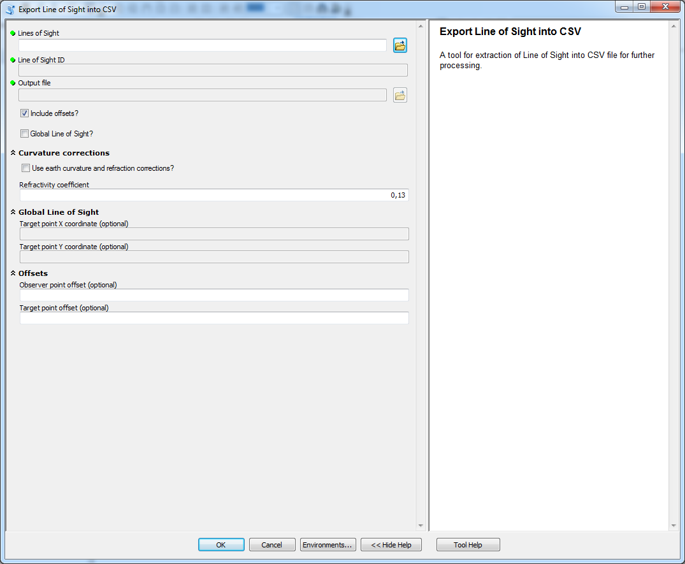

# Export Line of Sight into CSV

tool for exporting LoS into CSV format 

## Description

A tool for exporting LoS into format that can be processed outside ArcGIS.

## Tool parameters

| Parameter name | Parameter type | Description |
| ------------- |-------------| -----|
| **Lines of Sight** | *features - lines* | layer containing LoS. |
| **Line of Sight ID** | *id - select box* | ID of the LoS to be exported. |
| _**Output file**_ | _**file**_ | _**name and locations of the CSV that will be created.**_ |
| **Include offsets?** | *boolean* | export only LoS without observer and target offsets or include the offsets in LoS? Default value is to include the offsets. |
| **Global Line of Sight?** | *boolean* | is the LoS global? The tool tries to determine if the LoS is global based on typical fields. Warning message is shown if the tool determines that the LoS is global and this option is not checked. Default value is false. |
| **Observer point offset** | *field - double* | field of the layer Lines of Sight that has data type Double. If the field has default name **observ_offset** from tools in this toolbox then it is selected automatically. |
| **Target point offset** | *field - double* | field of the layer Lines of Sight that has data type Double. If the field has default name **target_offset** from tools in this toolbox then it is selected automatically. |
| **Target point X coordinate** | *field - double* | field of the layer Lines of Sight that has data type Double. If the field has default name **target_x** from tools in this toolbox then it is selected automatically. |
| **Target point Y coordinate** | *field - double* | field of the layer Lines of Sight that has data type Double. If the field has default name **target_y** from tools in this toolbox then it is selected automatically. |
| **Use earth curvature corrections?** | *boolean* | should Earth's curvature and refraction corrections be used? Default value is no. |
| **Refractivity coefficient** | *numerical value* | coefficient value (default 0.13). |

Parameters **Observer point offset** and **Target point offset** are summarized in parameter group **Offsets**, parameters **Target point X coordinate** and **Target point Y coordinate** in parameter group **Global Line of Sight** and parameters **Use earth curvature corrections?** and **Refractivity coefficient** in parameter group **Curvature corrections**

## Outputs

CSV file delimited by ";" with header "distance";"elevation" if LoS is local and "distance";"elevation";"target point"  if the LoS is global. Field "target point" have value 1 if the point is target point and 0 otherwise.

## Tool screenshot

	