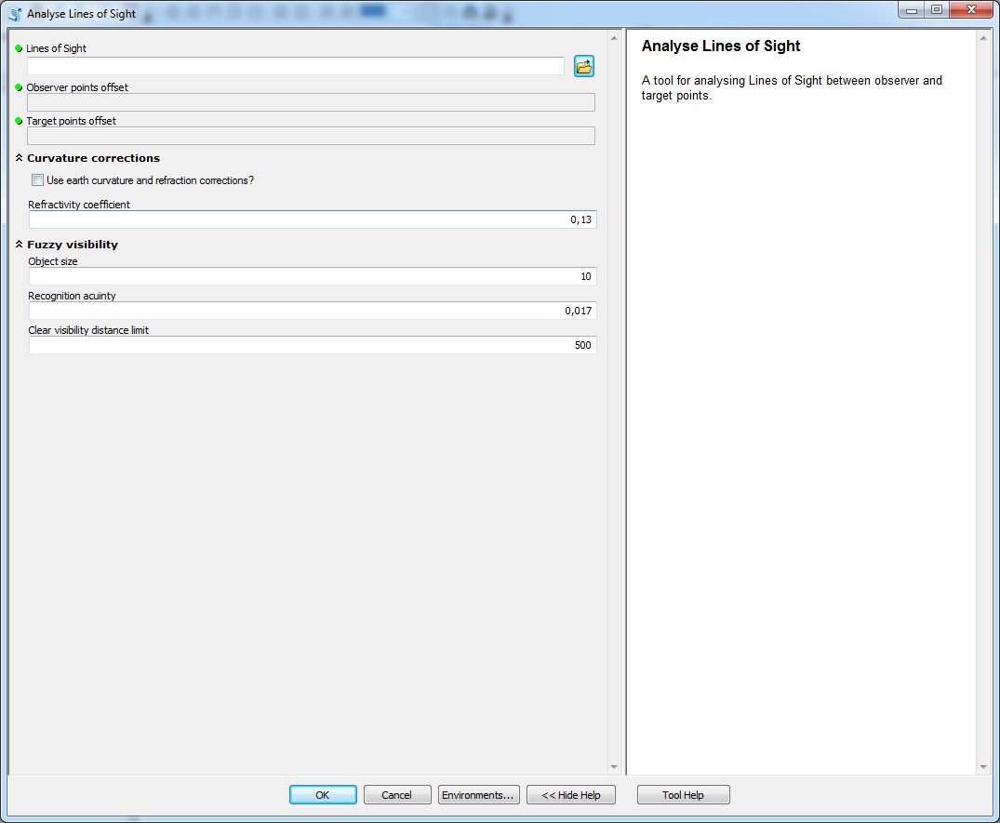

# Analyze of Lines of Sight

tool used to analyse LoS

## Description

A tool used to analyse LoS. The tool should be used only on local LoS that connect observer points with target points. There is another tool for analyses of Global LoS.

## Tool parameters

| Parameter name | Parameter type | Description |
|-------------|-------------|-----|
| **Lines of Sight** | *features - lines* | layer containing LoS. |
| **Observer points offset** | *field - double* | field of the layer Lines of Sight that has data type Double. If the field has default name (**observ_offset**) from tools in this toolbox then it is selected automatically. |
| _**Target points offset**_ | *field - double* | field of the layer Lines of Sight that has data type Double. If the field has default name (**target_offset**) from tools in this toolbox then it is selected automatically. |
| **Object size** | *numeric value* | size of the theoretical observed object. |
| **Recognition acuinty** | *numerical value* |acuinty of the observer\'s eye. Default value is \( 1^\prime \) or \( \frac{1}{60} \) of degree which equals to 0.017. |
| **Clear visibility distance limit** | *numerical value* | distance on which the user can absolutely clearly see the object with Object size. |
| **Use earth curvature corrections?** | *boolean* | should Earth's curvature and refraction corrections be used? |
| **Refractivity coefficient** | *numerical value* | coefficient value (default 0.13). |

Parameters **Object size**, **Recognition acuinty** and **Clearvisibility distance limit** are summarized in parameter group **Fuzzy visibility** as they are related to fuzzy visibility calculation only. Parameters **Use earth curvature corrections?** and **Refractivity coefficient** in parameter group **Curvature corrections**.

## Outputs

A set of new fieds for the layer **Lines of Sight**:

| Field name | Field type | Description |
|-------------|-------------|-----|
| Visible | Short | value indicating if the target point is visible (1) or invisible (0). | 
| ViewAngle | Double | vertical viewing angle from observer to target. Units are degrees. | 
| ElevDiff | Double | vertical difference amongst observer and target, negative value indicates that observer is lower then target. Units are the same as used in Lines of Sight. | 
| AngleDiff\_H | Double | angle difference between viewing angle of target and highest horizon on the LoS. Negative value indicates that the horizon hides target point, possitive value indicates how high above the horizon the target rises. Units are degrees. | 
| ElevDiff\_H | Double | elevation difference between target point and highest horizon on the LoS. Possitive value indicates how much of the target is visible (from the top towards bottom), negative value indicates how much higher the target had to be to be visible for the observer. Units are the same as used in Lines of Sight. | 
| SlopeDiff | Double | difference between viewing angle from observer to target and slope of LoS towards target. The closer the value to \( 90^\circ \) the better for observer as the target is more significant. Units are degrees. | 
| Horizon\_C | Short | number of visible horizons located between observer and target. | 
| HorDist | Double | distance from observer to the highest horizon on the LoS. Units are the same as used in Lines of Sight. | 
| FuzzyVis | Double | fuzzy visibility value indicating distinctiveness of the object defined by Fuzzy visibility parameters. Distinctiveness is best if the value is 1 and gets worser as the value approaches 0.

## Tool screenshot

	