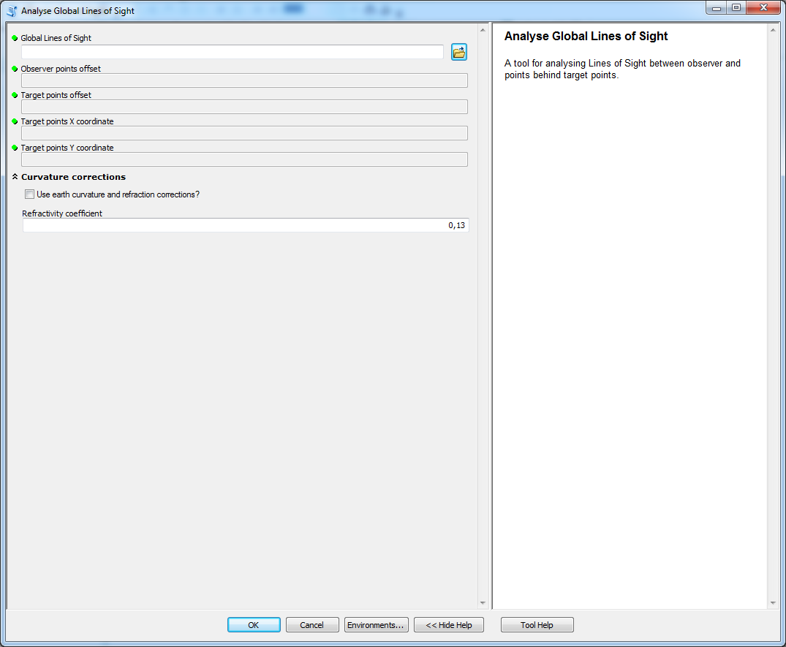

# Analyze Global Lines of Sight

tool used to analyse Global LoS

## Description

A tool used to analyse Global LoS. The tool should not be used for local LoS that connect only observer to target.

For purpose of these analyses the target point can not be a global horizon. This assumption allows to properly calculate all the characteristics of global LoS.

## Tool parameters

| Parameter name | Parameter type | Description |
|-------------|-------------|-----|
| **Global Lines of Sight** | *features - lines* | layer containing LoS. |
| **Observer points offset** | *field - double* | field of the layer Lines of Sight that has data type Double. If the field has default name (**observ_offset**) from tools in this toolbox then it is selected automatically. |
| _**Target points offset**_ | *field - double* | field of the layer Lines of Sight that has data type Double. If the field has default name (**target_offset**) from tools in this toolbox then it is selected automatically. |
| _**Target point X coordinate**_ | *field - double* | field of the layer Lines of Sight that has data type Double. If the field has default name (**target_x**) from tools in this toolbox then
it is selected automatically. |
| _**Target point Y coordinate**_ | *field - double* | field of the layer Lines of Sight that has data type Double. If the field has default name (**target_y**) from tools in this toolbox then it is selected automatically. |
| **Use earth curvature corrections?** | *boolean* | should Earth's curvature and refraction corrections be used? |
| **Refractivity coefficient** | *numerical value* | coefficient value (default 0.13). |

Parameters **Use earth curvature corrections?** and **Refractivity coefficient** in parameter group **Curvature corrections**.

## Outputs

A set of new fieds for the layer **Global Lines of Sight**:

| Field name | Field type | Description |
|-------------|-------------|-----|
| Visible | Short | value indicating if the target point is visible (1) or invisible (0). | 
| ViewAngle | Double | vertical viewing angle from observer to target. Units are degrees. | 
| ElevDiff | Double | vertical difference amongst observer and target, negative value indicates that observer is lower then target. Units are the same as used in Lines of Sight. | 
| AngleDiff\_GH | Double | angle difference between viewing angle of target and the global horizon on the LoS. Negative value indicates that the horizon is higher then target point, possitive value indicates that target point is highest point on LoS. Negative value does not mean that the target point is invisible as the global horizon can be located behind the target point. Units are degrees. | 
| ElevDiff\_GH | Double | elevation difference between target point and global horizon on the LoS. Positive value indicates how much of the target is visible against sky (from the top towards bottom), negative value indicates how much higher the target had to be to reach global horizon. Units are the same as used in Lines of Sight. | 
| HorDist | Double | distance between global horizon and target point. Negative value means that global horizon is located before target point, positive value means that it is located behind the target. | 
| Horizon\_C | Short | number of visible horizons located behind target point. |

## Tool screenshot

	