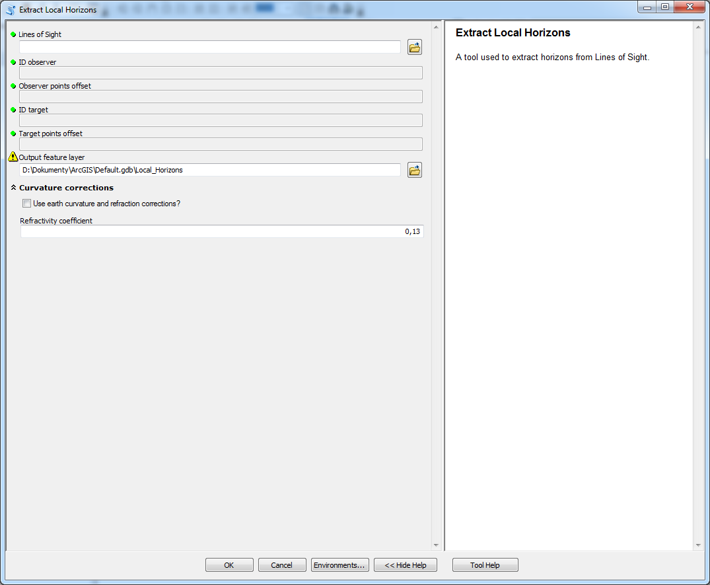

# Extract Local Horizons 

used to extract visible horizons from local LoS

## Description

A tool used to extract visible horizons from local LoS.

## Tool parameters

| Parameter name | Parameter type | Description |
|-------------|-------------|-----|
| **Lines of Sight** | *features - lines* | layer containing LoS. |
| **ID observer** | *Short* | field of the layer Lines of Sight that has data type Short. If the field has default name (**OID_OBSERV**) from tools in this toolbox then it is selected automatically. |
| **Observer points offset** | *field - double* | field of the layer Lines of Sight that has data type Double. If the field has default name (**observ_offset**) from tools in this toolbox then it is selected automatically. |
| **ID target** | *Short* | field of the layer Lines of Sight that has data type Short. If the field has default name (**OID_TARGET**) from tools in this toolbox then it is selected automatically.|
| **Target points offset** | *field - double* | field of the layer Lines of Sight that has data type Double. If the field has default name (**target_offset**) from tools in this toolbox then it is selected automatically. |
| _**Output feature layer**_ | _*features - points*_ | _output layer._ |
| **Use earth curvature corrections?** | *boolean* | should Earth's curvature and refraction corrections be used? |
| **Refractivity coefficient** | *numerical value* | coefficient value (default 0.13). |

Parameters **Use earth curvature corrections?** and **Refractivity coefficient** in parameter group **Curvature corrections**.

## Outputs

Point feature class containing horizons, that has Z-dimension. The feature class has fields that allow connection with observer points (**OID_OBSERV**), target points (**OID_TARGET**) and also LoS (**OID_LoS**).

Besides that there are several attributes of horizons:

| Field name | Field type | Description |
|-------------|-------------|-----|
| Hor\_Type | Short | value indicating if the horizon is highest horizon of LoS (value 1) or not (value 0). | 
| ViewAngle | Double | vertical viewing angle from observer to the horizon. Units are degrees. | 
| AngleDiff\_H | Double | angle difference between viewing angle of this horizon and previous horizon. Value zero means that there is no previous horizon. | 
| Dist\_Observ | Double | distance from horizon to the observer. | 

## Tool screenshot

	